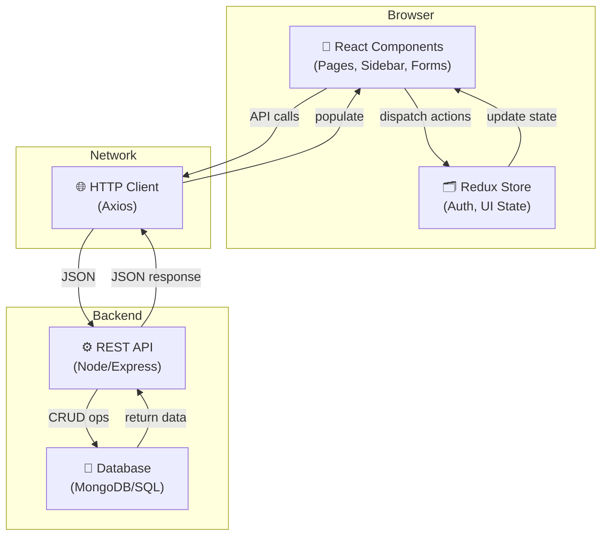
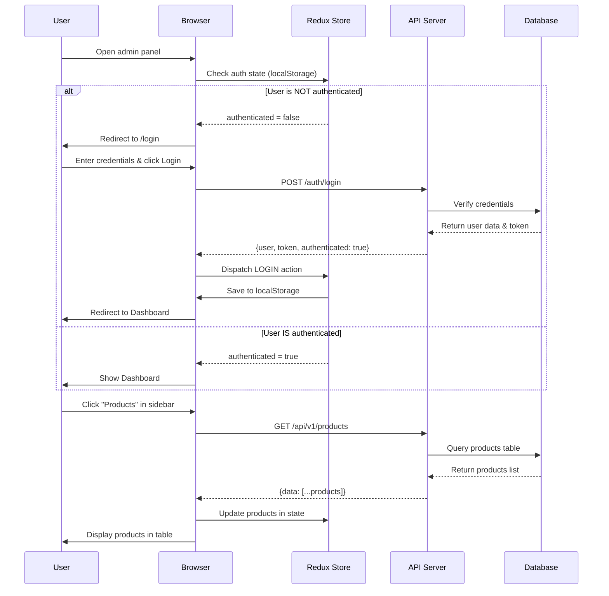
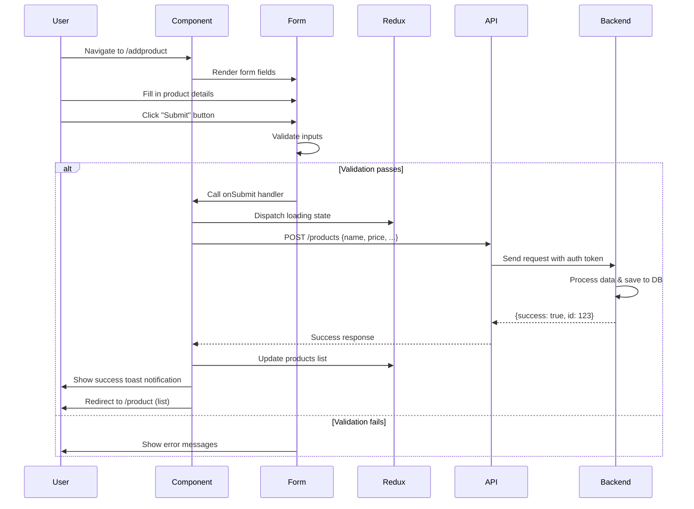
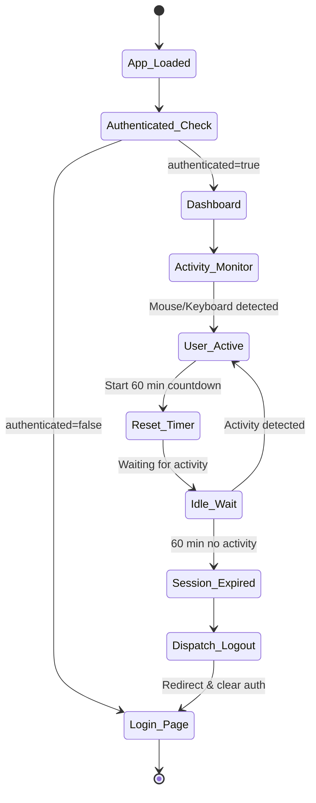
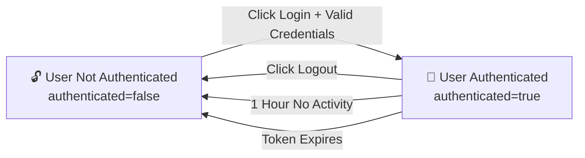
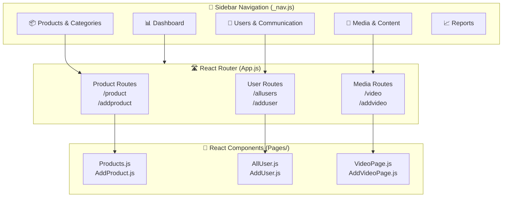
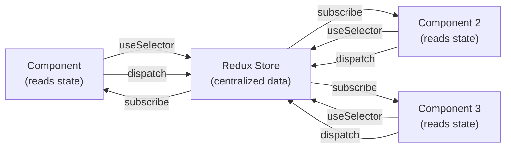
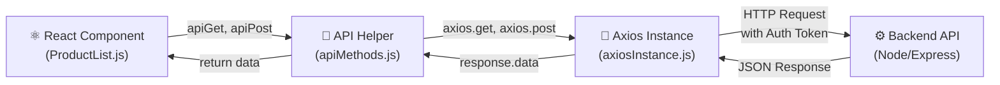
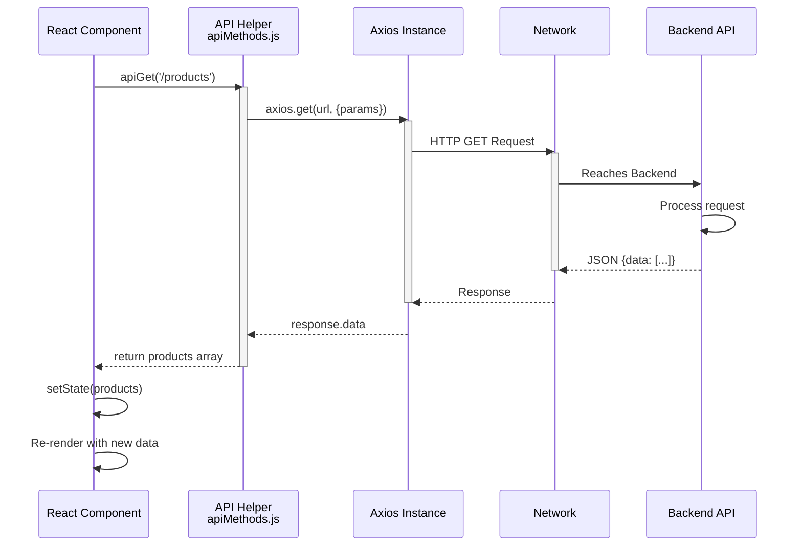
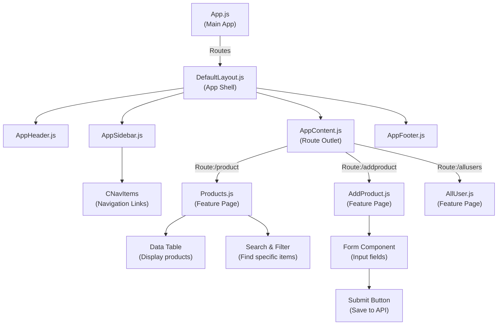

# 🎛️ Admin Panel - Complete Documentation

> **Welcome!** This document provides comprehensive guidance for developers, project managers, and stakeholders working with the admin panel. Whether you're setting up the project, building new features, or troubleshooting issues, you'll find detailed explanations and visual flows to help you navigate the codebase efficiently.

---

## 📋 Table of Contents

1. [Quick Start](#quick-start)
2. [What is This Project?](#what-is-this-project)
3. [Tech Stack Explained](#tech-stack-explained)
4. [Project Architecture](#project-architecture)
5. [Application Flows](#application-flows)
6. [Authentication & Sessions](#authentication--sessions)
7. [Routing & Navigation](#routing--navigation)
8. [State Management](#state-management)
9. [API Integration](#api-integration)
10. [Component Structure](#component-structure)
11. [Feature Modules](#feature-modules)
12. [Development Guide](#development-guide)
13. [Build & Deployment](#build--deployment)
14. [Troubleshooting](#troubleshooting)
15. [Best Practices](#best-practices)

---

## 🚀 Quick Start

Get the project running in 5 minutes:

```bash
# 1. Install dependencies
npm install

# 2. Start development server (opens at http://localhost:5173)
npm run dev

# 3. Open browser and navigate to the local server
# You'll see the login page - authenticate to access the dashboard
```

**Want to build for production?**

```bash
npm run build      # Creates optimized build in build/
npm run serve      # Preview the production build locally
```

---

## 🎯 What is This Project?

This is a **React-based Administrative Dashboard** designed to manage complex business operations. Think of it as the "control center" for your e-commerce or business platform.

**Key Responsibilities:**

- 📦 **Product Management** - Add, edit, organize products and categories
- 🎨 **Visual Content** - Manage banners, ads, logos, videos, testimonials
- 👥 **User Administration** - Create and manage user accounts and permissions
- 📊 **Order Tracking** - Monitor and view customer orders
- 📧 **Communication** - Manage newsletters, contact inquiries, complaints
- 🎭 **Customization** - Control color themes, design elements, showcase items

Built with **CoreUI** (a professional UI framework) for a polished, enterprise-ready experience, and powered by **React 18** for modern, responsive interactions.

---

## 💻 Tech Stack Explained

Each technology serves a specific purpose in our architecture:

| Technology          | Purpose                          | Why It's Used                                                 |
| ------------------- | -------------------------------- | ------------------------------------------------------------- |
| **React 18**        | UI library & component framework | Build interactive, reusable components                        |
| **React Router v6** | Client-side routing              | Navigate between pages without full page reloads              |
| **Redux**           | Global state management          | Share user info, auth status across all components            |
| **Axios**           | HTTP client                      | Make API requests to backend server                           |
| **CoreUI**          | Pre-built UI components          | Professional, accessible components (buttons, modals, tables) |
| **Bootstrap 5**     | CSS framework                    | Responsive grid system and utilities                          |
| **Vite**            | Development server & bundler     | Ultra-fast dev server and optimized production builds         |
| **React Toastify**  | Notification system              | Show success/error messages to users                          |
| **SCSS**            | CSS preprocessor                 | Write modular, maintainable styles                            |

---

## 🏗️ Project Architecture

### Directory Structure

```
admin_panel/
│
├── 📄 index.html              # HTML entry point
├── 📄 package.json            # Project dependencies
├── 📄 vite.config.mjs         # Vite configuration
│
├── 📂 src/                    # All source code
│   ├── 📄 App.js              # Main app component (routes & auth logic)
│   ├── 📄 index.js            # Application entry point
│   ├── 📄 store.js            # Redux store & authentication state
│   ├── 📄 _nav.js             # Sidebar navigation configuration
│   ├── 📄 routes.js           # Additional route definitions
│   │
│   ├── 📂 Api/                # API communication layer
│   │   ├── 📄 axiosInstance.js    # Axios configuration & base URL
│   │   └── 📄 apiMethods.js       # Reusable API helpers (GET/POST/PUT/DELETE)
│   │
│   ├── 📂 components/         # Reusable React components
│   │   ├── AppHeader.js       # Top navigation bar
│   │   ├── AppSidebar.js      # Left sidebar
│   │   ├── AppFooter.js       # Bottom footer
│   │   ├── ProtectedRoute.js  # Route protection wrapper
│   │   └── [Other UI components]
│   │
│   ├── 📂 Pages/              # Feature pages (full page components)
│   │   ├── product/
│   │   │   ├── Products.js    # Product list page
│   │   │   └── AddProduct.js  # Create product page
│   │   ├── category/
│   │   ├── banner/
│   │   ├── user/
│   │   └── [Other feature folders]
│   │
│   ├── 📂 views/              # Layout & dashboard views
│   │   └── dashboard/
│   │       └── Dashboard.js   # Main dashboard page
│   │
│   ├── 📂 layout/             # Layout containers
│   │   └── DefaultLayout.js   # Main app shell (header, sidebar, content)
│   │
│   ├── 📂 scss/               # Style files
│   │   └── style.scss         # Global styles
│   │
│   ├── 📂 CSS/                # CSS files
│   │
│   ├── 📂 assets/             # Static files
│   │   ├── images/
│   │   ├── brand/
│   │   └── Animation/
│   │
│   └── 📂 utils/              # Helper functions
│
├── 📂 public/                 # Static assets (manifest, etc.)
│
└── 📂 build/                  # Production build output (generated by npm run build)
    ├── index.html
    └── assets/
        └── [Bundled JS, CSS, images]
```

### Architecture Layers



---

## 🔄 Application Flows

### Overall Application Flow



### Feature Page Flow (Create/Update)



### Session & Activity Flow



---

## 🔐 Authentication & Sessions

### How Authentication Works

#### Login Flow

```
User Types Credentials → Form Submission → API /login →
Backend Validates → Returns {user, token} →
Redux LOGIN Action → localStorage Saved →
Redirect to Dashboard
```

#### Session Persistence

- When the app loads, it checks `localStorage.appState`
- If data exists, it restores the previous auth state
- User stays logged in across browser refreshes (until logout or token expires)

#### Session Timeout

- A 60-minute inactivity timer starts when user logs in
- **Activities that reset the timer:** mouse movement, keyboard input, clicks, scrolling
- **After timeout:** The app automatically logs out and redirects to login
- **Why?** Security - prevents unauthorized access if user leaves computer unattended

### Redux Auth State

```javascript
// Location: src/store.js

const authState = {
  user: {
    userId: '12345',
    email: 'admin@example.com',
    name: 'Admin User',
    role: 'admin',
    profileImage: 'url/to/image.jpg',
    phone_number: '+1-234-567-8900',
    idToken: 'eyJhbGc...', // JWT token for API calls
  },
  authenticated: true, // true = logged in, false = need login
  isAdmin: true, // true = has admin privileges

  // Other state
  sidebarShow: true, // Sidebar visible/hidden
  theme: 'light', // Light/dark mode
}
```

### Authentication State Diagram



---

## 🧭 Routing & Navigation

### How Routing Works

The app uses **React Router v6** for client-side navigation. No full page refreshes - just component swaps!

#### Route Definition (src/App.js)

```javascript
// Routes are defined here and automatically sync with sidebar
<Route path="/product" element={<Products />} />
<Route path="/addproduct" element={<AddProduct />} />
// Navigation pattern: List page → Create page
```

#### Sidebar Navigation (src/\_nav.js)

```javascript
// Sidebar structure mirrors the routes
{
  name: 'Product',
  icon: cilCart,
  items: [
    { name: 'Products List', to: '/product' },
    { name: 'Add Product', to: '/addproduct' }
  ]
}
```

### Complete Route Map with Organization

#### 📊 Dashboard & Core

| Route    | Component | Purpose                                  |
| -------- | --------- | ---------------------------------------- |
| `/`      | Dashboard | Main dashboard - overview of key metrics |
| `/login` | Login     | User authentication page                 |

#### 📦 Product Management

| Route                 | Component        | Purpose                              |
| --------------------- | ---------------- | ------------------------------------ |
| `/product`            | Products         | List all products with search/filter |
| `/addproduct`         | AddProduct       | Create new product                   |
| `/categorylist`       | CategoryList     | Browse product categories            |
| `/addcategory`        | AddCategory      | Create new category                  |
| `/subcategorylist`    | SubcategoryList  | Manage subcategories                 |
| `/addsubcategory`     | AddSubcategory   | Create subcategory                   |
| `/main-category-list` | MainCategoryList | Top-level categories                 |

#### 🍔 Food & Kits

| Route       | Component | Purpose           |
| ----------- | --------- | ----------------- |
| `/foodlist` | FoodList  | View food items   |
| `/addfood`  | AddFood   | Add new food item |
| `/kit-list` | KitList   | View product kits |

#### 🎨 Visual Content

| Route               | Component     | Purpose                   |
| ------------------- | ------------- | ------------------------- |
| `/home-banner-list` | HomeBanner    | Homepage banner list      |
| `/add-home-banner`  | AddHomeBanner | Create homepage banner    |
| `/allbanners`       | AllBanner     | Standard banners          |
| `/addbanners`       | AddBanner     | Create banner             |
| `/headerads`        | HeaderAdsList | Header advertisement list |
| `/addheaderads`     | AddHeaderAds  | Create header ad          |
| `/alladsbanner`     | AdsBanner     | Additional ad banners     |
| `/addadsbanner`     | AddAdsBanner  | Create ad banner          |
| `/logo`             | Logo          | Company logo management   |
| `/colortheme`       | ColorTheme    | Color scheme management   |
| `/addcolortheme`    | AddColorTheme | Create color scheme       |

#### 🎥 Media & Content

| Route                 | Component              | Purpose                 |
| --------------------- | ---------------------- | ----------------------- |
| `/video`              | VideoPage              | Video list              |
| `/addvideo`           | AddVideoPage           | Upload/add video        |
| `/alltestimonialpage` | TestimonialPage        | Customer testimonials   |
| `/addtestimonialpage` | AddTestimonialPage     | Add testimonial         |
| `/allshowcasebox`     | Showcasebox            | Featured showcase items |
| `/addshowcasebox`     | AddShowcasebox         | Create showcase item    |
| `/allcare`            | CareInstructionPage    | Care instructions       |
| `/addcare`            | AddCareInstructionPage | Create care guide       |
| `/alladditionalinfo`  | AdditionalInfoPage     | Additional information  |
| `/addadditionalinfo`  | AddAdditionalInfoPage  | Add info section        |

#### 👥 Users & Communication

| Route                | Component       | Purpose                  |
| -------------------- | --------------- | ------------------------ |
| `/allusers`          | AllUser         | User management list     |
| `/adduser`           | AddUser         | Create new user          |
| `/contact-us`        | ContactUs       | View contact submissions |
| `/news-email-letter` | NewsEmailLetter | Email newsletter list    |
| `/designer-list`     | DesignerList    | Designer management      |
| `/designer-create`   | AddDesigner     | Add new designer         |

#### 📈 Reviews & Reports

| Route                 | Component                | Purpose                  |
| --------------------- | ------------------------ | ------------------------ |
| `/product-review`     | ProductReview            | Customer product reviews |
| `/complaint-report`   | ComplaintPage            | Customer complaints      |
| `/order`              | Order                    | Order management         |
| `/personalized-query` | CustomQueryListComponent | Custom design requests   |

### Navigation Architecture Diagram



---

## 🗂️ State Management

### Redux Architecture

Redux is like the app's "brain" - it holds all important data that components need to access.



### State Structure (src/store.js)

```javascript
{
  // Authentication & User Info
  authenticated: true,                    // Is user logged in?
  user: {
    userId: "123",
    email: "admin@example.com",
    name: "Admin User",
    role: "admin",
    profileImage: "...",
    phone_number: "+1-xxx-xxx-xxxx",
    idToken: "jwt-token-here"
  },
  isAdmin: true,                         // Admin privileges?

  // UI State
  theme: 'light',                        // 'light' or 'dark'
  sidebarShow: true                      // Sidebar visible?
}
```

### Reducer Actions (How to Update State)

```javascript
// Action: User logs in
dispatch({
  type: 'LOGIN',
  userId: '123',
  email: 'user@example.com',
  name: 'John Doe',
  authenticated: true,
  // ... other user fields
})

// Action: User logs out
dispatch({
  type: 'LOGOUT',
})
// Result: user = null, authenticated = false, isAdmin = false

// Action: Generic state update
dispatch({
  type: 'set',
  theme: 'dark',
  sidebarShow: false,
})
```

### LocalStorage Persistence

State is automatically saved to browser's localStorage under key `appState`:

```javascript
// When app loads
const savedState = localStorage.getItem('appState')
// Restored and used as Redux initial state

// When state changes
// Automatically saved to localStorage
store.subscribe(() => {
  localStorage.setItem('appState', JSON.stringify(state))
})

// Result: User stays logged in even after page refresh ✅
```

---

## 🌐 API Integration

### API Architecture



### Axios Instance Setup (src/Api/axiosInstance.js)

```javascript
// Base configuration for all API calls
const liveUrl = 'https://print-api.projects-digitalgourmet.in'
const middleware = '/api/v1'
const baseUrlMain = liveUrl + middleware

const axiosInstance = axios.create({
  baseURL: baseUrlMain,
  withCredentials: true, // Include cookies in requests
  headers: {
    'Content-Type': 'application/json',
  },
})

// Every request to '/products' becomes:
// https://print-api.projects-digitalgourmet.in/api/v1/products
```

### API Helper Methods (src/Api/apiMethods.js)

```javascript
// GET - Fetch data
const products = await apiGet('/products', { category: 'electronics' })
// Makes: GET https://...baseUrl.../products?category=electronics

// POST - Create new data
const newProduct = await apiPost('/products', {
  name: 'Laptop',
  price: 999,
  category: 'electronics',
})
// Makes: POST with JSON body

// POST with Files - Upload images/documents
const data = new FormData()
data.append('file', imageFile)
data.append('productId', '123')
await apiPost('/upload', data, true) // true = isFormData

// PUT - Update existing data
const updated = await apiPut('/products/123', {
  name: 'Updated Laptop',
  price: 899,
})

// DELETE - Remove data
await apiDelete('/products/123')
```

### Complete API Call Flow



### Error Handling Pattern

```javascript
// Try-catch pattern used throughout API calls
try {
  const data = await apiGet('/products')
  // Success - handle data
  setProducts(data)
  showSuccessToast('Products loaded')
} catch (error) {
  // Error - show message to user
  console.error('API Error:', error)
  showErrorToast(error.message || 'Failed to load products')
}
```

---

## 🧩 Component Structure

### Component Hierarchy



### Reusable Components

#### 1. AppHeader

- **Location:** src/components/AppHeader.js
- **Purpose:** Top navigation bar
- **Contains:** Logo, user menu, notifications
- **Used By:** DefaultLayout

#### 2. AppSidebar + Navigation

- **Location:** src/components/AppSidebar.js, \_nav.js
- **Purpose:** Left sidebar with navigation menu
- **Contains:** Navigation items configured in `_nav.js`
- **Controlled By:** Redux state (sidebarShow)

#### 3. DefaultLayout

- **Location:** src/layout/DefaultLayout.js
- **Purpose:** Main app shell that wraps all pages
- **Contains:** Header, Sidebar, Content area (Route outlet), Footer
- **Renders:** Everything visible after login

#### 4. Protected Route (Future Use)

- **Location:** src/components/Hooks/ProtectedRoute.js
- **Purpose:** Prevent unauthorized access to routes
- **Currently:** Imported but not used - can be implemented for role-based access

---

## 📦 Feature Modules

### Each Feature Follows This Pattern:

```
Feature/
├── FeatureName.js          # List page (display items)
├── AddFeatureName.js       # Create/Edit page (form)
├── FeatureName.css         # Styles (optional)
└── Components/
    └── Subcomponents       # Feature-specific components
```

### Example: Product Feature

```
Pages/product/
├── Products.js             # List all products
├── AddProduct.js           # Create/Edit product
├── ProductFilter.js        # Filter & search logic
└── ProductTable.js         # Table display component
```

**List Page Flow:**

```
1. Component loads
2. useEffect: Fetch products via API
3. Map through products array → render table rows
4. Add click handlers: Edit button → navigate to AddProduct
5. Add delete button → call API → refresh list
```

**Create/Edit Page Flow:**

```
1. Component loads
2. Check if editing (URL params) → fetch existing data
3. Render form with fields
4. On submit: Validate inputs
5. Call API POST/PUT with data
6. Show success toast
7. Redirect back to list
```

---

## 👨‍💻 Development Guide

### Adding a New Feature (Step-by-Step)

#### Step 1: Create Route in App.js

```javascript
// src/App.js
const MyNewFeature = React.lazy(() => import('./Pages/mynewfeature/MyNewFeature'))

<Route path="/mynewfeature" element={<MyNewFeature />} />
<Route path="/addmynewfeature" element={<AddMyNewFeature />} />
```

#### Step 2: Add Navigation in \_nav.js

```javascript
// src/_nav.js
{
  component: CNavGroup,
  name: 'My New Feature',
  icon: <CIcon icon={cilCart} />,
  items: [
    {
      component: CNavItem,
      name: 'Feature List',
      to: '/mynewfeature'
    },
    {
      component: CNavItem,
      name: 'Add New Item',
      to: '/addmynewfeature'
    }
  ]
}
```

#### Step 3: Create Feature Pages

```javascript
// src/Pages/mynewfeature/MyNewFeature.js
import { apiGet, apiDelete } from '../../Api/apiMethods'
import { useState, useEffect } from 'react'

export default function MyNewFeature() {
  const [items, setItems] = useState([])
  const [loading, setLoading] = useState(true)

  useEffect(() => {
    loadItems()
  }, [])

  const loadItems = async () => {
    try {
      const data = await apiGet('/mynewfeature')
      setItems(data)
    } catch (error) {
      console.error('Error loading items:', error)
    } finally {
      setLoading(false)
    }
  }

  // ... render list table
}
```

```javascript
// src/Pages/mynewfeature/AddMyNewFeature.js
import { apiPost, apiPut } from '../../Api/apiMethods'
import { useState } from 'react'
import { useNavigate } from 'react-router-dom'

export default function AddMyNewFeature() {
  const navigate = useNavigate()
  const [formData, setFormData] = useState({})

  const handleSubmit = async (e) => {
    e.preventDefault()
    try {
      await apiPost('/mynewfeature', formData)
      navigate('/mynewfeature') // Go back to list
    } catch (error) {
      console.error('Error saving:', error)
    }
  }

  // ... render form
}
```

#### Step 4: Test in Browser

```bash
npm run dev
# Visit http://localhost:5173
# Click on your new feature in sidebar
# Test create, read, update, delete operations
```

### Common Development Tasks

#### Task: Add a New Form Field

```javascript
// In your Add/Edit page component

const [formData, setFormData] = useState({
  name: '',
  description: '',
  newField: ''  // ← Add here
})

// In your form JSX
<input
  value={formData.newField}
  onChange={(e) => setFormData({...formData, newField: e.target.value})}
  placeholder="Enter new field"
/>
```

#### Task: Call Backend API

```javascript
import { apiGet, apiPost } from '../../Api/apiMethods'

// Get data
const data = await apiGet('/endpoint')

// Create data
await apiPost('/endpoint', { name: 'value' })

// Handle errors
try {
  const data = await apiGet('/endpoint')
} catch (error) {
  alert('Error: ' + error.message)
}
```

#### Task: Show Toast Notification

```javascript
import { toast } from 'react-toastify'

// Success
toast.success('Item created successfully!')

// Error
toast.error('Failed to create item')

// Info
toast.info('Processing...')
```

#### Task: Navigate Programmatically

```javascript
import { useNavigate } from 'react-router-dom'

const navigate = useNavigate()

// After successful save
navigate('/mynewfeature') // Go to list

// With parameters
navigate(`/editmynewfeature/${id}`)
```

---

## 🏗️ Build & Deployment

### Development Workflow

```bash
# Start development server
npm run dev
# Server runs on http://localhost:5173
# Hot reload enabled - changes appear instantly
```

### Production Build

```bash
# Create optimized production build
npm run build
# Creates: build/ directory with minified assets

# Test production build locally
npm run serve
# Visit http://localhost:4173 to preview
```

### Build Output Structure

```
build/
├── index.html                    # Entry HTML file
├── manifest.json                 # PWA manifest
├── assets/
│   ├── index-ksJspMkp.css       # Main CSS bundle
│   ├── index-YhJK8CdT.js        # Main JS bundle
│   ├── Products-SVX1dAOQ.js     # Lazy-loaded pages
│   ├── AddProduct-D2yJMtb5.js   # Lazy-loaded pages
│   └── [Other lazy-loaded chunks]
```

### Deployment Checklist

Before deploying to production:

- [ ] Update API base URL in src/Api/axiosInstance.js to production server
- [ ] Run `npm run build` and verify no errors
- [ ] Test production build with `npm run serve`
- [ ] Verify all routes work correctly
- [ ] Test API calls with production backend
- [ ] Check console for any errors
- [ ] Deploy `build/` folder to your hosting

### Environment-Specific Configuration

**Recommended:** Use Vite environment variables

```javascript
// .env.development
VITE_API_BASE_URL=http://localhost:3000/api/v1

// .env.production
VITE_API_BASE_URL=https://print-api.projects-digitalgourmet.in/api/v1

// src/Api/axiosInstance.js
const baseUrlMain = import.meta.env.VITE_API_BASE_URL
```

---

## 🐛 Troubleshooting

### Common Issues & Solutions

#### Issue 1: Always Redirects to Login

**Symptoms:** App keeps showing login page even after entering credentials

**Causes & Solutions:**

```javascript
// 1. Check Redux auth state
console.log(store.getState().authenticated) // Should be true after login

// 2. Verify JWT token is being saved
console.log(localStorage.getItem('appState')) // Should contain user object

// 3. Check API response from login endpoint
// In Network tab → Login request → Response should include user data

// 4. Verify LOGIN action is dispatched correctly
// In Redux DevTools or console
dispatch({
  type: 'LOGIN',
  authenticated: true,
  userId: '...',
  // ... all required fields
})
```

#### Issue 2: API Calls Return 401 Unauthorized

**Symptoms:** API calls fail with 401 error

**Causes & Solutions:**

```javascript
// 1. Check if auth token is being sent
// In Network tab → any API request → Headers → Authorization

// 2. Verify token hasn't expired
const token = store.getState().user?.idToken
console.log('Token exists:', !!token)

// 3. Check if axios is sending token
// Add this to axiosInstance.js interceptor:
axiosInstance.interceptors.request.use((config) => {
  const token = store.getState().user?.idToken
  if (token) {
    config.headers.Authorization = `Bearer ${token}`
  }
  return config
})

// 4. Verify API base URL is correct
console.log('API Base URL:', import.meta.env.VITE_API_BASE_URL)
```

#### Issue 3: Pages Show Blank After Navigation

**Symptoms:** Clicking sidebar link loads page but nothing displays

**Causes & Solutions:**

```javascript
// 1. Check browser console for errors
// Look for: "Failed to import", "Cannot read property"

// 2. Verify lazy-loaded component file exists
// Make sure: src/Pages/mynewfeature/MyFeature.js exists

// 3. Check file path in App.js lazy import
const MyFeature = React.lazy(() => import('./Pages/mynewfeature/MyFeature'))
// ^ Path must match actual file location

// 4. Verify component exports default
// File should have: export default MyFeature
```

#### Issue 4: Form Won't Submit

**Symptoms:** Clicking submit button does nothing

**Causes & Solutions:**

```javascript
// 1. Check handleSubmit function
const handleSubmit = async (e) => {
  e.preventDefault()  // ← Must prevent default form behavior
  // ... rest of code
}

// 2. Verify form has onSubmit handler
<form onSubmit={handleSubmit}>

// 3. Check for validation errors
// Make sure all required fields are filled

// 4. Check browser console for errors
// API call might be failing silently
```

#### Issue 5: Images/Assets Not Loading

**Symptoms:** Images show broken icon or don't appear

**Causes & Solutions:**

```javascript
// 1. Check image path
// Development: /public/images/logo.png
// Production: ./assets/images/logo.png (relative path)

// 2. Verify file exists in public/ folder
// For assets used at build time: place in src/assets/

// 3. Use correct import in code
import logo from '/assets/images/logo.png' // ← with /

// 4. Check file permissions
// Ensure images are readable by the build system
```

---

## 💡 Best Practices

### Code Quality & Performance

#### 1. Always Handle Errors in API Calls

```javascript
// ❌ WRONG - Silent failure
const data = await apiGet('/products')
setProducts(data)

// ✅ CORRECT - Explicit error handling
try {
  const data = await apiGet('/products')
  setProducts(data)
} catch (error) {
  toast.error('Failed to load products')
  setProducts([])
}
```

#### 2. Use Async/Await Over Promises

```javascript
// ❌ Harder to read
apiGet('/products')
  .then((data) => setProducts(data))
  .catch((err) => console.error(err))

// ✅ Cleaner and more readable
try {
  const data = await apiGet('/products')
  setProducts(data)
} catch (err) {
  console.error(err)
}
```

#### 3. Validate Form Data Before Submission

```javascript
// ❌ WRONG - Send invalid data
const handleSubmit = (e) => {
  e.preventDefault()
  apiPost('/products', formData)
}

// ✅ CORRECT - Validate first
const handleSubmit = (e) => {
  e.preventDefault()

  // Validate
  if (!formData.name) {
    toast.error('Product name is required')
    return
  }
  if (formData.price <= 0) {
    toast.error('Price must be greater than 0')
    return
  }

  apiPost('/products', formData)
}
```

#### 4. Use Loading States for Better UX

```javascript
// ❌ WRONG - User won't know if button was clicked
;<button onClick={handleSubmit}>Submit</button>

// ✅ CORRECT - Show loading feedback
const [isLoading, setIsLoading] = useState(false)

const handleSubmit = async () => {
  setIsLoading(true)
  try {
    await apiPost('/products', formData)
    toast.success('Product created!')
  } finally {
    setIsLoading(false)
  }
}

;<button onClick={handleSubmit} disabled={isLoading}>
  {isLoading ? 'Loading...' : 'Submit'}
</button>
```

#### 5. Lazy Load Heavy Components

```javascript
// ✅ GOOD - Lazy load pages for faster initial load
const Products = React.lazy(() => import('./Pages/product/Products'))

<Suspense fallback={<Spinner />}>
  <Routes>
    <Route path="/product" element={<Products />} />
  </Routes>
</Suspense>
```

### Security Best Practices

#### 1. Never Store Sensitive Data in Redux

```javascript
// ❌ WRONG - Exposed in localStorage
user: {
  password: 'secret123',  // NEVER!
  ssn: '123-45-6789'      // NEVER!
}

// ✅ CORRECT - Only store non-sensitive data
user: {
  userId: '123',
  email: 'user@example.com',
  role: 'admin',
  // NO passwords, NO sensitive personal data
}
```

#### 2. Always Validate Input on Backend

```javascript
// Frontend validation is for UX, not security
// Backend MUST also validate:

// Frontend validation (UX only)
if (!formData.name) {
  toast.error('Name required')
}

// Backend validation (actual security)
// POST /products
// if (!req.body.name) return res.status(400).send('Name required')
```

#### 3. Use Auth Tokens Properly

```javascript
// ✅ Token in HTTP-only cookie is most secure
// or stored in sessionStorage (clears on tab close)

// Store in Redux ONLY for display purposes
// Add to every API request in axios interceptor

axiosInstance.interceptors.request.use((config) => {
  const token = store.getState().user?.idToken
  if (token) {
    config.headers.Authorization = `Bearer ${token}`
  }
  return config
})
```

### Component Organization

#### 1. Keep Components Focused & Small

```javascript
// ❌ WRONG - Component does too much
export default function ProductManagement() {
  // - Fetches data
  // - Filters data
  // - Creates new items
  // - Edits items
  // - Deletes items
  // - 500+ lines of code
}

// ✅ CORRECT - Separate concerns
export default function ProductList() {
  // Only displays list + edit/delete buttons
  // Delegates to other components
}

export default function ProductForm() {
  // Only handles form creation/editing
  // Calls parent callback on submit
}

export default function ProductSearch() {
  // Only handles filtering
  // Passes filtered results to parent
}
```

#### 2. Use PropTypes for Type Safety

```javascript
import PropTypes from 'prop-types'

function ProductItem({ product, onDelete, onEdit }) {
  return (...)
}

ProductItem.propTypes = {
  product: PropTypes.shape({
    id: PropTypes.number.required,
    name: PropTypes.string.required,
    price: PropTypes.number.required
  }).required,
  onDelete: PropTypes.func.required,
  onEdit: PropTypes.func.required
}
```

#### 3. Document Complex Functions

```javascript
/**
 * Formats product data from API for display
 * @param {Array} rawProducts - Raw data from backend
 * @returns {Array} Formatted products with computed fields
 *
 * Example:
 * const formatted = formatProducts(apiData)
 */
function formatProducts(rawProducts) {
  return rawProducts.map((p) => ({
    ...p,
    displayPrice: `$${p.price.toFixed(2)}`,
    inStock: p.quantity > 0,
  }))
}
```

### State Management Rules

#### 1. Redux for Global State Only

```javascript
// ✅ Redux (Global state)
Redux stores:
- User info (authenticated)
- Theme preference
- Global UI state (sidebar open/closed)

// ❌ Local state (Component useState)
useState for:
- Form inputs
- Loading states
- Component-specific data
- Temporary UI states
```

#### 2. Keep Redux State Minimal

```javascript
// ❌ WRONG - Too much data in Redux
products: [         // Should be in component state
  { id: 1, ... },
  { id: 2, ... }
],
users: [ ... ],     // Should be in component state
orders: [ ... ]     // Should be in component state

// ✅ CORRECT - Only global data
user: { ... },      // Needed everywhere
authenticated: true,
theme: 'light',
sidebarShow: true
```

---

## 📞 Support & Additional Resources

### Getting Help

1. **Check This Documentation** - Most common questions are answered here
2. **Browser Console** - Check for error messages: Press F12 → Console tab
3. **Network Tab** - Debug API calls: Press F12 → Network tab
4. **Redux DevTools** - Monitor state changes (install browser extension)

### Useful Tools

- **Postman** - Test API endpoints manually
- **VS Code** - Recommended code editor with React extensions
- **Chrome DevTools** - Built-in browser developer tools
- **Git** - Version control for tracking changes

### Learning Resources

- [React Docs](https://react.dev) - Official React documentation
- [Redux Guide](https://redux.js.org/tutorials/essentials/part-1-overview-and-concepts) - Redux state management
- [React Router v6](https://reactrouter.com/) - Client-side routing
- [Axios Docs](https://axios-http.com/) - HTTP client library
- [CoreUI React](https://coreui.io/react/docs/templates/installation/) - UI component library

---

## ✅ Quick Reference Checklist

### Before Starting Development

- [ ] Run `npm install` to install dependencies
- [ ] Run `npm run dev` to start dev server
- [ ] Verify app loads at http://localhost:5173
- [ ] Check API base URL in src/Api/axiosInstance.js

### When Adding a New Feature

- [ ] Create route in src/App.js
- [ ] Add navigation item in src/\_nav.js
- [ ] Create Pages/feature/Feature.js (list)
- [ ] Create Pages/feature/AddFeature.js (create)
- [ ] Test in browser - navigate to feature
- [ ] Test CRUD operations (Create, Read, Update, Delete)

### Before Deploying

- [ ] All features tested locally
- [ ] No console errors
- [ ] API calls work with production URL
- [ ] Run `npm run build` successfully
- [ ] Test production build with `npm run serve`
- [ ] Update environment variables for production

---

**Last Updated:** April 2026  
**Documentation Version:** 2.0  
**Maintained By:** Development Team

## Tech Stack

- React 18 + React Router v6 (client routing)
- CoreUI React + Bootstrap 5 (UI framework)
- Redux (global state and auth persistence)
- Axios (API client)
- Vite (dev server and build tool)
- React Toastify (notifications)

## Project Structure (Key Areas)

- src/App.js: Main routing, auth redirect, and session timeout logic
- src/\_nav.js: Sidebar navigation model
- src/routes.js: Additional route definitions used by layout
- src/store.js: Redux store, auth state, and localStorage persistence
- src/Api/axiosInstance.js: Axios base configuration and API base URL
- src/Api/apiMethods.js: Common API helper methods (GET/POST/PUT/PATCH/DELETE)
- src/Pages/: Feature pages (list and create flows)
- src/components/: Shared UI components
- build/: Production build output

## Local Setup

1. Install dependencies:
   - npm install
2. Start development server:
   - npm run dev
3. Build for production:
   - npm run build
4. Preview production build:
   - npm run serve

## Configuration

### API Base URL

The API base URL is defined in src/Api/axiosInstance.js:

- liveUrl: https://print-api.projects-digitalgourmet.in
- middleware: /api/v1
- baseUrlMain: liveUrl + middleware

If you need to switch environments, update the values in axiosInstance.js or replace them with a Vite env variable such as VITE_API_BASE_URL.

## Authentication and Session Behavior

- Auth state is stored in Redux and persisted to localStorage key: appState
- On app load, if authenticated is false, the app redirects to /login
- Session timeout: after 1 hour of inactivity, the app dispatches LOGOUT
- Activity that resets the timer: mousemove, keydown, click, scroll

Auth state shape (src/store.js):

- user: { userId, email, profileImage, role, name, idToken, phone_number }
- authenticated: boolean
- isAdmin: boolean

## Routing and Navigation

Routes are defined in src/App.js and surfaced in the sidebar via src/\_nav.js. The DefaultLayout is mounted at / and renders the main app shell.

### Route Map (from App.js)

| Path                | Screen                     |
| ------------------- | -------------------------- |
| /                   | DefaultLayout (main shell) |
| /login              | Login                      |
| /headerads          | Header Ads List            |
| /addheaderads       | Add Header Ads             |
| /allbanners         | Banner List                |
| /addbanners         | Add Banner                 |
| /allcare            | Care Instruction List      |
| /addcare            | Add Care Instruction       |
| /alladditionalinfo  | Additional Info List       |
| /addadditionalinfo  | Add Additional Info        |
| /alltestimonialpage | Testimonial List           |
| /addtestimonialpage | Add Testimonial            |
| /allshowcasebox     | Showcasebox List           |
| /addshowcasebox     | Add Showcasebox            |
| /alladsbanner       | Ads Banner List            |
| /addadsbanner       | Add Ads Banner             |
| /video              | Video List                 |
| /addvideo           | Add Video                  |
| /product            | Product List               |
| /addproduct         | Add Product                |
| /categorylist       | Category List              |
| /addcategory        | Add Category               |
| /main-category-list | Main Category List         |
| /subcategorylist    | Subcategory List           |
| /addsubcategory     | Add Subcategory            |
| /kit-list           | Kit List                   |
| /foodlist           | Food List                  |
| /addfood            | Add Food                   |
| /home-banner-list   | Home Banner List           |
| /add-home-banner    | Add Home Banner            |
| /order              | Order List                 |
| /contact-us         | Contact Us List            |
| /news-email-letter  | News Email List            |
| /product-review     | Product Review List        |
| /logo               | Logo List                  |
| /colortheme         | Color Theme List           |
| /addcolortheme      | Add Color Theme            |
| /allusers           | Users List                 |
| /adduser            | Add User                   |
| /complaint-report   | Complaint Report           |
| /designer-list      | Designer List              |
| /designer-create    | Add Designer               |
| /personalized-query | Custom Design Query List   |

### Sidebar Navigation Groups (from \_nav.js)

- Dashboard
- Main Category
- Category
- Subcategory
- Home Banner
- Product
- Kit
- Order
- Header Ads
- Testimonial
- Banner
- Showcasebox
- Ads Banner
- Contact Us
- News Email
- Product Review
- User
- Logo
- Video
- Color
- Query
- Report
- Designers

## Data Flow and API Layer

The API layer uses a shared Axios instance (src/Api/axiosInstance.js) and helper methods (src/Api/apiMethods.js). These helpers return response data or throw API error payloads.

Example usage pattern:

```js
import { apiGet, apiPost } from '../Api/apiMethods'

const loadItems = async () => {
  const data = await apiGet('/products')
  return data
}

const createItem = async (payload) => {
  const data = await apiPost('/products', payload)
  return data
}
```

## App Flow Diagram

```mermaid
flowchart TD
  A[User opens app] --> B{authenticated?}
  B -- no --> L[Redirect to /login]
  B -- yes --> C[DefaultLayout (/)]
  C --> D[Sidebar Navigation]
  D --> E[Feature Page]
  E --> F[API Call via axiosInstance]
  F --> G[Backend API]
  G --> E
  C --> H[Activity Listener]
  H --> I[Reset 1h timer]
  I -->|timeout| J[Dispatch LOGOUT]
  J --> L
```

## Notifications

A ToastContainer is mounted globally with autoClose set to 1000 ms. Use React Toastify for success/error feedback on API actions.

## Build Output

Production builds are generated in the build/ directory (vite build). The default entry point is build/index.html.

## Troubleshooting

- If the app always redirects to /login, verify authenticated is set to true in Redux after login.
- If API calls fail, confirm the API base URL in src/Api/axiosInstance.js is correct and reachable.
- If the app loads but pages are blank, check console for failed lazy-loaded imports.

## Notes and Recommendations

- ProtectedRoute is imported in App.js but not currently used. If you need stricter route protection, wrap routes with ProtectedRoute or use nested routes inside DefaultLayout.
- Consider moving API base URLs to Vite env vars for easier environment switching.
